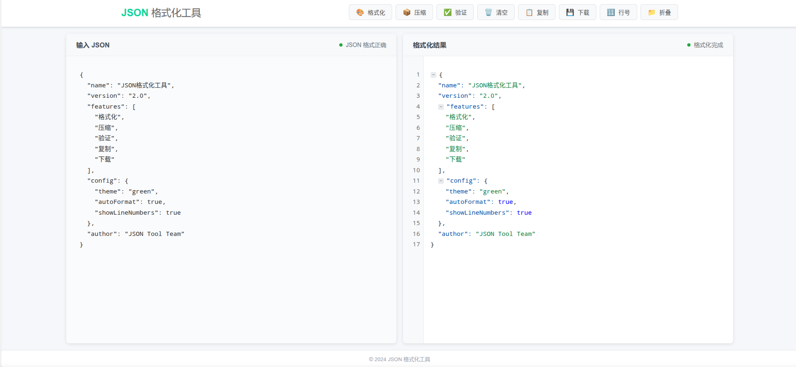

# JSON 在线格式化工具

一个现代化、功能丰富的 JSON 在线格式化和验证工具。

## 📸 预览



## ✨ 主要特性

- **JSON 格式化** - 美化和格式化 JSON 数据
- **JSON 压缩** - 移除空格和换行符，压缩 JSON
- **JSON 验证** - 实时验证 JSON 语法正确性
- **语法高亮** - 彩色语法高亮显示
- **行号显示** - 可选的行号显示功能
- **节点折叠** - 折叠/展开 JSON 节点
- **文件操作** - 支持文件保存、复制、拖拽上传
- **响应式设计** - 完美适配桌面和移动设备

## 🚀 快速开始

```bash
# 克隆项目
git clone <repository-url>

# 进入目录
cd json-format

# 使用 HTTP 服务器运行
python -m http.server 8000
# 或
npx serve .
```

在浏览器中打开 `http://localhost:8000`

## 📖 使用说明

1. **格式化** - 在左侧输入 JSON 数据，右侧自动显示格式化结果
2. **压缩** - 点击"压缩"按钮移除空格和换行
3. **验证** - 实时验证 JSON 语法，错误会高亮显示
4. **文件操作** - 支持保存、复制、拖拽文件

### 快捷键

- `Ctrl/Cmd + S` - 保存文件
- `Ctrl/Cmd + K` - 清空内容
- `Ctrl/Cmd + Enter` - 格式化

## 🛠️ 技术栈

- **HTML5 + CSS3 + JavaScript** - 纯前端实现
- **响应式设计** - 支持各种设备
- **现代浏览器** - Chrome 60+, Firefox 55+, Safari 12+

## 📄 许可证

MIT License

---

**享受使用 JSON 格式化工具！** 🎉
